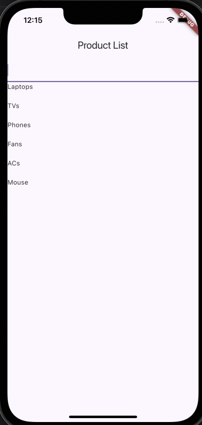
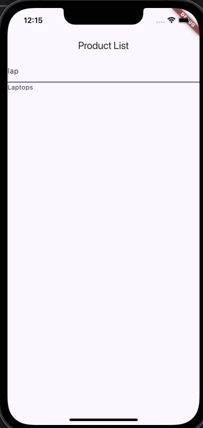

# riverpod_practice

This Flutter project demonstrates the implementation of a search functionality using the Riverpod state management package. The app filters a product list based on the user’s search input and displays the results dynamically.

## **Directory Structure**

The `lib/search/` directory contains the following files:

- **`product_notifier.dart`**: Contains the Riverpod `StateNotifier` and provider for managing and filtering the product list.
- **`product_filter_screen.dart`**: The UI screen where users can search for products and view the filtered list.
- **`product_model.dart`**: Defines the `Product` model used to represent individual products.

---

## **Features**

- **State Management with Riverpod**: Uses `StateNotifier` and `StateNotifierProvider` to manage product data and filter logic.
- **Dynamic Search**: Filters the product list in real-time based on the user’s input.
- **Clean Architecture**: Separates logic, data models, and UI components into individual files for better maintainability.

---

## **File Descriptions**

### 1. **`product_model.dart`**
### 2. **`product_notifier.dart`**
### 3. **`product_filter_screen.dart`**
The UI screen where:
- Users can input search queries.
- 
- The filtered product list is displayed dynamically.
- 
- Integrates with Riverpod providers to fetch and display filtered data.

---

## **Getting Started**

1. **Install Dependencies**
   Run the following command to install the required packages:
   ```bash
   flutter pub get
   ```

2. **Run the App**
   Start the app using:
   ```bash
   flutter run
   ```

## **Packages Used**

- [**Riverpod**](https://pub.dev/packages/riverpod): For state management.
- [**Flutter**](https://flutter.dev): For building the UI.
- Check pubspec.yaml for more plugins

---

## **Future Enhancements**

- Add pagination to handle large product lists.
- Integrate a backend API for dynamic product data.
- Improve UI with animations and better UX.

